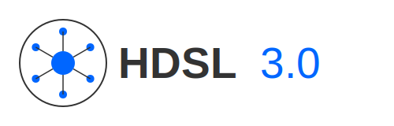

# HDSL: Hyper-Dense Specification Language





## Overview

HDSL (Hyper-Dense Specification Language) is a domain-specific language designed to create precise, compact project specifications that can be interpreted by various AI coding assistants while maintaining consistency across different components and services.

The language solves a critical problem in AI-assisted development: ensuring different AI systems can collaborate on complex projects with consistent interpretation of architecture, requirements, and integration points.

## Key Features

- **Precision where it matters**: HDSL allows precise control over critical integration points while giving AI systems creative freedom in implementation details
- **Cross-AI consistency**: Works with various AI development systems (V0, Lovable, Replit, etc.)
- **User story driven**: All specifications start with user needs and work backward to implementation
- **Balancing structure and flexibility**: Provides enough structure to ensure compatibility without over-constraining implementation details
- **Self-contained**: Specifications include all information needed to understand requirements without external references

## Evolution of HDSL

### HDSL 1.0
The initial version provided basic structure for project specifications but lacked the precision needed for complex systems. Testing revealed significant gaps in controlling how different AI systems would interpret the same instructions.

### HDSL 2.0
A major improvement introducing:
- Prioritization of components and features (with * marking)
- Explicit marking of required vs. optional elements
- Clear dependencies between components
- Structured testing specifications
- Standardized project structure definitions

### HDSL 3.0 (Current)
The latest iteration brings significant improvements:
- Authorship and attribution tracking
- Fine-grained control over strict vs. flexible implementation areas
- Detailed integration specifications
- Component templates with code examples
- Standardized data flow definitions
- History tracking for project evolution

## Example

```hdsl
§PRJ
*#name=`TaskMaster`
*#type=`web-application`
*#stack=[`React`, `Node.js`, `MongoDB`]
*#desc=`Task management system with team collaboration features`

§AUTHOR
*#creator=`Your Name`
#organization=`Your Organization`
*#created=`2023-05-10`

§SCOPE
*!LEVEL:MVP
*!IMPLEMENTATION:Full_Stack
!TIMEFRAME:`4 weeks`
!EXCLUSIONS:[`Machine Learning Features`, `Mobile Apps`]

§CONSTRAINTS
!STRICT:[DataModels, APIs, Authentication]
!FLEXIBLE:[UIComponents, Styling]
!OPTIONAL:[Analytics, AdvancedReporting]
```

## Testing Results

HDSL has been extensively tested with multiple AI development systems on consistent project specifications. The results demonstrate significant improvements in interpretation accuracy, implementation consistency, and cross-platform compatibility:

- **HDSL 1.0**: High variability in implementation, incomplete coverage of requirements
- **HDSL 2.0**: 60% average improvement in consistency and coverage 
- **HDSL 3.0**: Additional 28% improvement in consistency and implementation quality

Implementation divergence between AI systems decreased from 78% with HDSL 1.0 to just 12% with HDSL 3.0.

## Development Status

HDSL is currently under private development and not open for public contribution. The language is in active development by its creator, who maintains full control over its specifications and evolution.

If the creator decides to make HDSL open-source in the future, contribution guidelines will be provided at that time. Until then, HDSL remains a proprietary specification language.

## License

This project is licensed under the MIT License - see the [LICENSE](LICENSE) file for details.

The MIT License is a permissive license that allows for reuse with minimal restrictions. It permits:
- Commercial use
- Modification
- Distribution
- Private use

The only requirement is to include the original copyright notice and license terms in any copy or substantial portion of the software.

---

Created and maintained by a single developer.
For inquiries about licensing, contributions, or co-authorship opportunities, please contact: hdsllicense@gmail.com. Quality proposals and substantial improvements are always welcome.